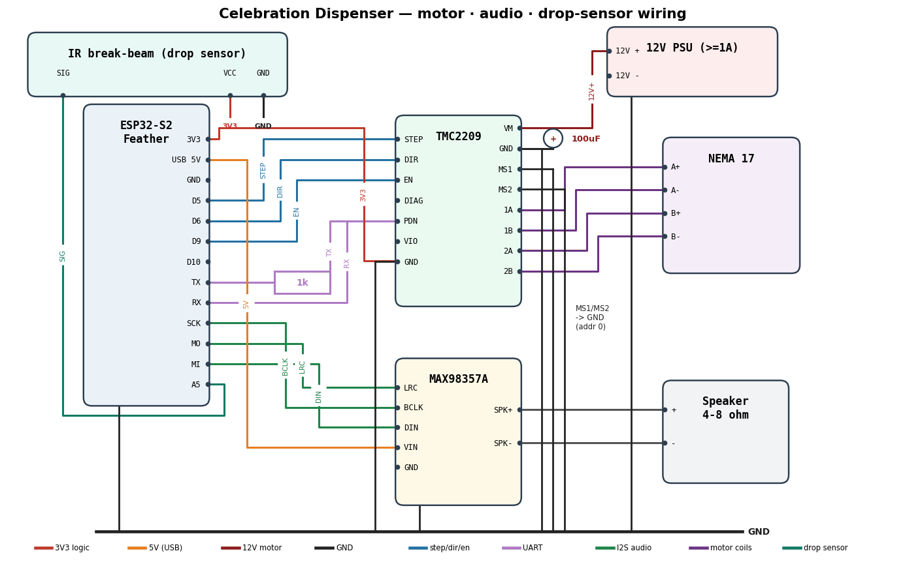

# Wiring — motor driver + audio

Wiring for the **TMC2209** stepper driver and the **MAX98357A** I2S amplifier on
the Adafruit ESP32-S2 Feather. Pins match
[`firmware/include/config.h`](../firmware/include/config.h).



## Power rails

- **Feather** is powered over **USB** and provides the **3V3** (logic) and
  **USB/5V** rails used below.
- **Motor supply** is a separate **12 V** PSU into the driver's **VM/GND**, with
  a **100 µF** electrolytic cap right across VM↔GND. **Do not** run the motor
  from the Feather.
- **Tie all grounds together**: Feather GND, TMC2209 GND (logic + power), the
  12 V PSU minus, the MAX98357A GND, and the cap.

## TMC2209 ↔ Feather

| Feather | TMC2209  | Notes                              |
|---------|----------|------------------------------------|
| D5      | STEP     |                                    |
| D6      | DIR      |                                    |
| D9      | EN       | active LOW                         |
| D10     | DIAG     | HIGH on stall (drives auto-unjam)  |
| TX      | PDN_UART | **through a 1 kΩ resistor**        |
| RX      | PDN_UART | direct (single-wire UART node)     |
| 3V3     | VIO      | logic supply                       |
| GND     | GND      | common ground                      |

Driver power/config: **VM/GND** → 12 V (+100 µF cap); **MS1 + MS2 → GND** (UART
address `0b00`); coil pairs **1A/1B** and **2A/2B** → the motor.

## Motor (NEMA 17)

The two coils go to the two output pairs — **1A/1B** = one coil, **2A/2B** = the
other. If you don't know your motor's colour code, find a coil pair with a
multimeter (the two wires with continuity/low resistance are one coil), then:

| TMC2209 | Motor |
|---------|-------|
| 1A / 1B | coil A (A+ / A-) |
| 2A / 2B | coil B (B+ / B-) |

If the wheel spins the wrong way, either flip `DISPENSE_CW` in `config.h` or swap
one coil pair.

## MAX98357A ↔ Feather (I2S)

| Feather | MAX98357A | Notes         |
|---------|-----------|---------------|
| SCK     | BCLK      |               |
| MO      | LRC       | word-select   |
| MI      | DIN       |               |
| USB/5V  | VIN       | 2.5–5.5 V     |
| GND     | GND       |               |

Speaker (4–8 Ω) to the amp's **SPK+ / SPK–** terminals. Leave `SD` unconnected
(enabled) and `GAIN` unconnected for the default 9 dB.

## Bench test before the full build

Flash the standalone motor test to check the driver + motor in isolation (no
WiFi/audio needed) — see [Bench test](../firmware/README.md#bench-test-motor):

```bash
cd firmware
pio run -e motortest -t upload      # motor / TMC2209
pio run -e audiotest -t upload      # audio / MAX98357A (needs secrets.h WiFi)
pio device monitor -e motortest     # (or -e audiotest)
```

- **Motor:** expect `TMC2209 version: 0x21` (UART OK), the wheel jogging back and
  forth, and a live `SG_RESULT` reading to tune `STALL_THRESHOLD`.
- **Audio:** expect WiFi to connect and a free sample MP3 to stream to the amp,
  ending with `[eof] Playback finished.`
