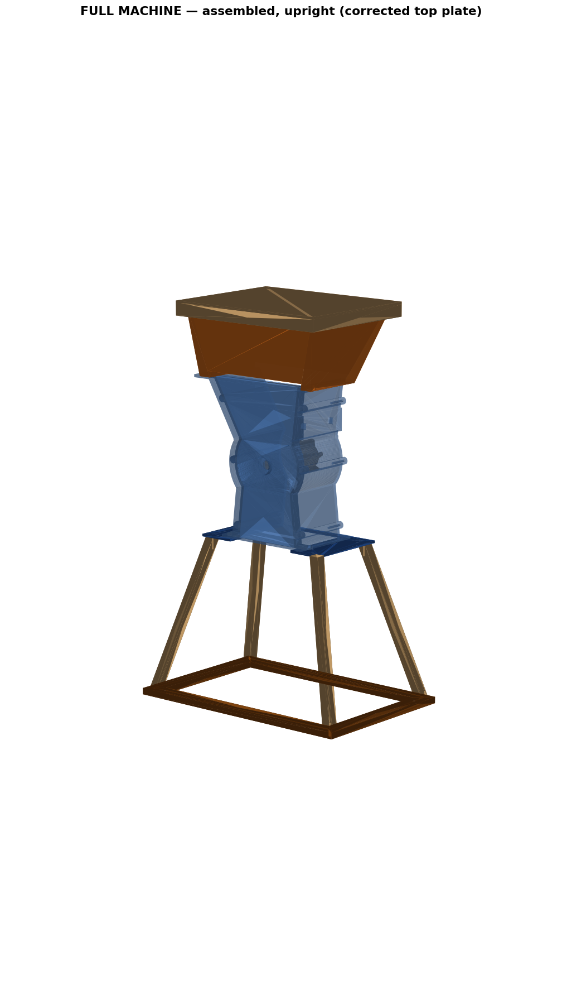
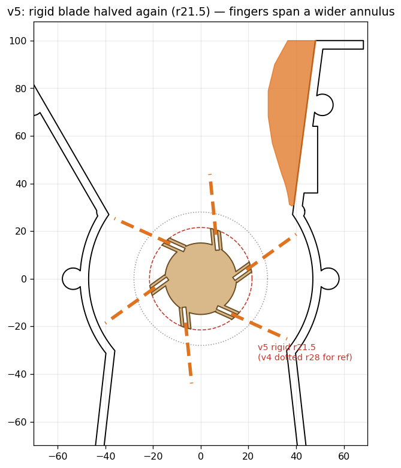
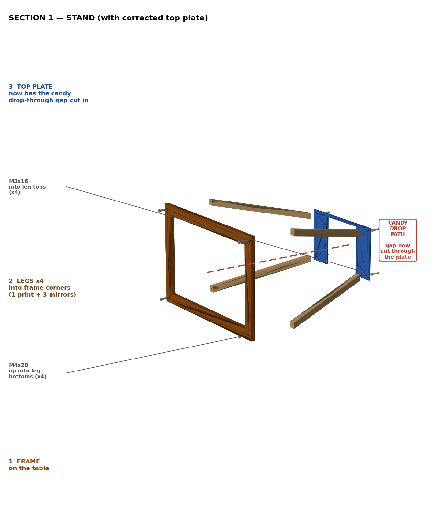
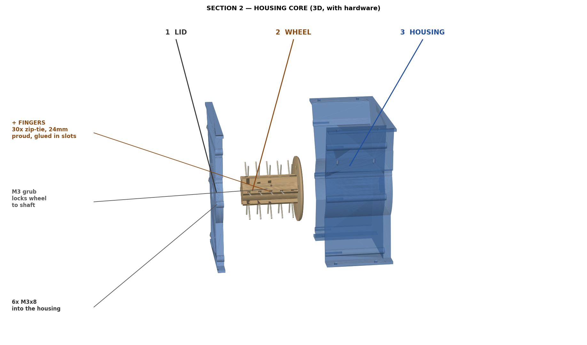
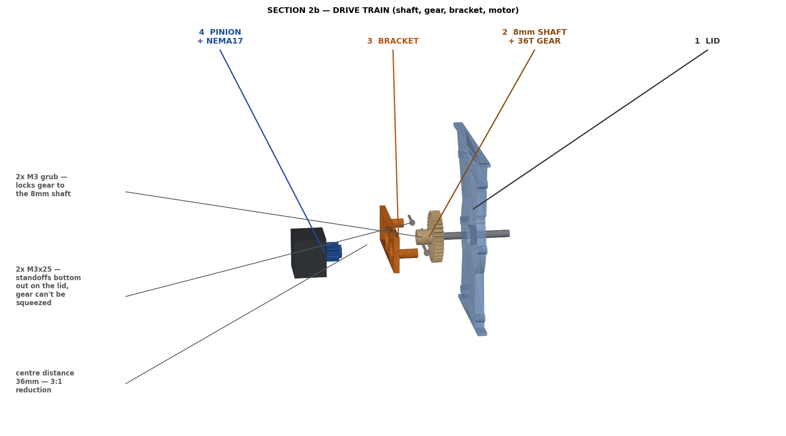
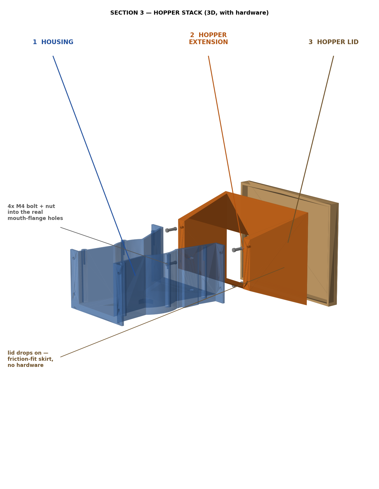

# Hardware

3D-printable parts and assembly for the Celebration Dispenser.

The mechanism is a **finger wheel**: a printed wheel fitted with flexible
zip-tie "fingers" spins inside a housing, driven by the stepper. Candy sits in
the hopper above; the sweeping fingers agitate it and meter it through the
housing outlet. One button press = one dispense.

The fingers reach out to a wide annulus so they sweep close to the housing wall
(this is the `v5` wheel — cross-section below):

## Parts to print

Files in [`stl/`](stl/), with measured bounding boxes so you can check they fit
your printer's bed. Preview renders are in [`stl/previews/`](stl/previews/).

| File                             | Size X×Y×Z (mm)   | Role                                   |
|----------------------------------|-------------------|----------------------------------------|
| `housing-main-608.stl`           | 174 × 195 × 92    | Main housing; holds the wheel + 608 bearings |
| `housing-lid-608.stl`            | 174 × 195 × 10    | Housing lid (6× M3×8)                  |
| `vane-wheel-v5-half-blade.stl`   | 90 × 90 × 80      | Finger wheel — takes the zip-tie fingers |
| `wheel-drive-pinion-12T.stl`     | 21 × 21 × 20      | 12T pinion on the NEMA 17 shaft         |
| `wheel-driven-gear-36T-v2.stl`   | 57 × 57 × 28      | 36T gear on the 8 mm wheel shaft (3:1)  |
| `wheel-motor-bracket-v5-counterbore.stl` | 117 × 40 × 26 | Motor bracket (holds the NEMA 17)   |
| `hopper-extension-onepiece.stl`  | 204 × 94 × 150    | Hopper body; bolts to the housing mouth |
| `hopper-lid.stl`                 | 212 × 18 × 166    | Hopper lid (friction fit, no hardware) |
| `stand-top-plate.stl`            | 184 × 106 × 3     | Plate the housing mounts to            |
| `stand-leg-single.stl`           | 70 × 200 × 57     | Leg — print **×4** (1 + mirror 3 in your slicer) |
| `stand-bottom-frame.stl`         | 300 × 8 × 200     | Base frame tying the legs together     |

> `housing-main` and the hopper are large (≈195–212 mm on their longest edge) —
> confirm they fit your build plate before slicing.

### Suggested print settings

- **Material:** PLA is fine indoors; PETG if it'll see any heat/sun.
- **Layer height:** 0.2 mm.
- **Walls / top / bottom:** 3 perimeters, 4 top/bottom layers.
- **Infill:** 20–30% (more for the finger wheel — it takes the load).
- **Supports:** likely needed on the housing (bearing pockets / overhangs) and
  possibly the hopper mouth — check each part in your slicer.

## Bill of materials (non-printed)

### Electronics

| Item                                   | Qty | Notes                                   |
|----------------------------------------|-----|-----------------------------------------|
| Adafruit ESP32-S2 Feather              | 1   | WiFi + 2 MB PSRAM (for streamed audio)  |
| NEMA 17 stepper motor                  | 1   | Drives the finger wheel                 |
| TMC2209 stepper driver                 | 1   | Silent; StallGuard stall-detect for auto-unjam |
| MAX98357A I2S amplifier                | 1   | Plays the streamed celebration audio    |
| Speaker, 4–8 Ω                         | 1   | To the MAX98357A output                 |
| WS2812 / NeoPixel strip                | 1   | 16 px default (see `firmware/config.h`) |
| Momentary push button                  | 1   |                                         |
| 12 V power supply (≥1 A)               | 1   | For the motor via the driver            |
| 100 µF cap, 330–470 Ω + 1 kΩ resistors | 1ea | Driver VM cap; LED data line; TMC2209 UART |

Wiring and pin map: [`../firmware/README.md`](../firmware/README.md).

### Mechanical fasteners

| Item                          | Qty  | Where                                    |
|-------------------------------|------|------------------------------------------|
| Zip ties (~2.5 mm wide)       | 30   | Wheel **fingers** — 24 mm proud, glued in the slots |
| Super glue (CA)               | —    | To fix the zip-tie fingers in their slots |
| 608 bearings (8 mm bore)      | 2    | Support the wheel shaft in the housing   |
| 8 mm shaft                    | 1    | Rides in the 608 bearings                |
| M3 grub / set screw           | 3    | 1 locks the wheel, 2 lock the 36T gear, to the shaft |
| M3 × 25 screws                | 2    | Motor-bracket standoffs (bottom out on the lid) |
| M3 × 8 screws                 | 6    | Housing lid → housing                    |
| M4 bolt + nut                 | 4    | Hopper extension → housing mouth-flange  |
| M4 × 20 screws                | 4    | Stand: up into the leg bottoms           |
| M3 × 16 screws                | 4    | Stand: top plate down into the leg tops  |

## Assembly

### Section 1 — Stand

1. **Frame** — lay `stand-bottom-frame` flat on the table.
2. **Legs ×4** — fit a leg into each frame corner and fasten from below with
   **M4 × 20** screws (×4). Print the leg once and **mirror 3 copies** in your
   slicer so all four corners match.
3. **Top plate** — set `stand-top-plate` onto the leg tops and secure with
   **M3 × 16** screws (×4).

### Section 2 — Housing core

1. **Fingers** — push **30 zip ties** into the wheel's slots so ~**24 mm**
   stands proud, and **glue** them in place.
2. **Wheel on the shaft** — fit the two **608 bearings** and the **8 mm shaft**
   into the housing, mount the finger wheel on the shaft, and lock it with the
   **M3 grub screw**.
3. **Close the lid** — `housing-lid-608` onto `housing-main-608` with
   **6× M3×8**, leaving the 8 mm shaft protruding for the drive train.

### Section 2b — Drive train

1. **36T gear** — slide `wheel-driven-gear-36T-v2` onto the protruding 8 mm
   shaft and lock it with **2× M3 grub** screws.
2. **12T pinion** — fit `wheel-drive-pinion-12T` onto the NEMA 17 shaft.
3. **Bracket + motor** — bolt the motor to `wheel-motor-bracket-v5-counterbore`
   and fasten the bracket to the lid on **2× M3×25** standoffs. The standoffs
   bottom out on the lid so the gears can't be squeezed together; the pinion
   meshes with the 36T gear at a **36 mm centre distance** for a **3:1
   reduction**.

### Section 3 — Hopper stack

1. **Hopper extension** — bolt `hopper-extension-onepiece` to the housing's
   mouth-flange holes with **4× M4 bolt + nut**.
2. **Hopper lid** — `hopper-lid` just **drops on** (friction-fit skirt, no
   hardware).

### Final

Mount the housing on the stand's top plate, wire the electronics per the
firmware README (share all grounds), load candy, flash, and press the button.

## Tuning the dispense

Mechanics are fixed by the prints, but how much/how fast is dispensed is set in
the firmware — see [`../firmware/include/config.h`](../firmware/include/config.h):
`DISPENSE_REVS` (portion size), `STEPPER_MAX_SPEED` / `STEPPER_ACCEL` (speed),
`DISPENSE_CW` (direction), `MOTOR_CURRENT_MA`, and `STALL_THRESHOLD` (jam
sensitivity for the auto-unjam).
